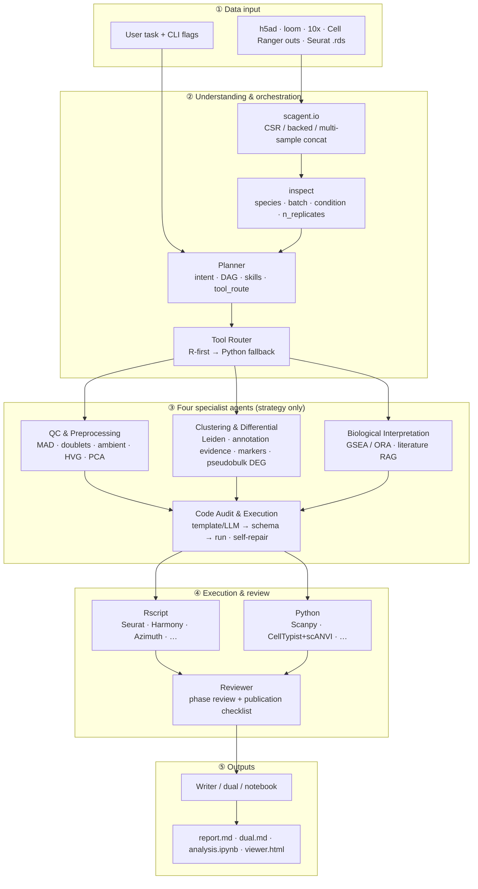
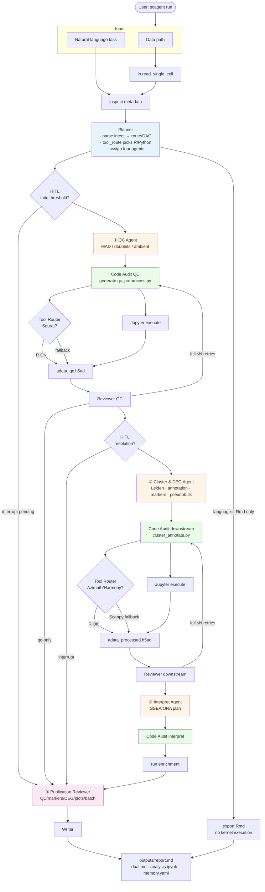

# Single-Cell RNA-seq Analysis Agent

> **Languages:** [English](README.en.md) (this document) | [中文](README.md)

LangGraph-based agent for single-cell bioinformatics. Compared with CellAgent or generic SciAgent-Skills, scAgent enforces **tissue-aware QC, execution review, and auditable scripts**—not just tutorial code generation.

Existing SciAgent-style skills are **preserved as-is**. `knowledge/` holds fused RAG plus a structured KB (offline subsets of Cell Ontology, CellMarker/PanglaoDB, MSigDB, disease signatures, HCA tissue maps). Annotation and interpretation retrieve JSON records, not prompt prose.

## Quick Start

```bash
pip install -r requirements.txt && pip install -e ".[dev]"
python -m scagent init
python -m scagent demo
python -m scagent run "demo QC + annotation" --data tests/data/tiny_100cells.h5ad --tissue pbmc --dry-run
```

New users can run `scagent init` to interactively set data path, tissue, analysis task, and memory/CPU/timeout limits. It writes `outputs/init.yaml` and optionally `config.local.yaml` (does not overwrite `config.yaml` or store API keys), then prints the equivalent `scagent run …` command. Use `--yes` for defaults; `--run` to start immediately after setup.

Or four lines of Python:

```python
from scagent.demo import write_tiny_h5ad
from scagent.io import read_single_cell
adata = read_single_cell(write_tiny_h5ad())   # 100 cells, CSR sparse
print(adata)
```

The demo is a 100-cell sparse `.h5ad` (`tests/data/tiny_100cells.h5ad`) for CI and local smoke tests. Replace the path with your own h5ad for real data.

## Workflow

### Architecture overview

The diagram below shows how layers cooperate: data is inspected and planned by the Planner; four specialist agents output **analysis strategies and protocols only** (no executable code); Code Audit generates scripts and runs them via the **Tool Router (R-first)**; Reviewer gates quality; Writer assembles the report.



| Layer | Module | Role |
|-------|--------|------|
| Data input | `scagent.io` | Unified readers; backed mode for large h5ad; multi-sample `obs['sample']` |
| Orchestration | inspect + Planner | Detect batch/condition/replicate count; build DAG, skills, integration & DEG policy |
| Tool Router | `scagent/tool_router` | Default **R ecosystem first**; fall back to Scanpy when R packages are missing |
| Specialist agents | QC / Cluster / Interpret | Emit protocols and parameters; **do not execute** analysis directly |
| Execution | Code Audit | Generate `workspace/*.py`, run via Jupyter or Rscript, emit metrics |
| Review | Reviewer | Code AST/DAG + execution results + publication checklist |
| Output | Writer | Reads `artifacts` only; marks figures as "not executed" when missing |

---

### End-to-end flow (HITL & retries)



**Legend:** blue = orchestration; orange = domain expert agents; green = code generation & execution; pink = publication review.

The pipeline is **Planner (orchestration only) → four specialist agents (strategy) → Code Audit (execution) → Publication Report**.

| Agent | Responsibility | Typical outputs |
|-------|----------------|-----------------|
| QC & Preprocessing | Validation, MAD/doublets/ambient, HVG, PCA | `qc_strategy`, LOCKED QC blocks |
| Clustering & Differential | Leiden, CellTypist+scANVI/Azimuth, **structured marker_db + CL**, dual validation, pseudobulk DEG | `annotation_plan`, `cluster_annotate.py` |
| Biological Interpretation | Pathway enrichment (GSEA/GSVA/ORA) + **fused RAG** + MSigDB/disease-signature JSON | `interpretation_plan` |
| Code Audit & Execution | Strategy → executable code, schema/DAG guardrails, Rscript/Jupyter, self-repair | `workspace/*.py`, `run_manifest.json` |

Phase Reviewers check both **code** and **execution** (metrics, `SCAGENT_WARN`). The publication Reviewer aggregates QC / markers / DEG / plots / batch correction. Writer uses **only** `artifacts`; without `--execute`, the report states figures were not generated.

**Checkpoint:** LangGraph SQLite stores `AgentState`; h5ad snapshots live in `.cache/snapshots/`; resume with `--resume`.

## Installation

```bash
python -m venv .venv
source .venv/bin/activate
pip install -r requirements.txt
pip install -e ".[dev]"
# For real Scanpy runs, install the analysis stack (see requirements-analysis.txt):
pip install -r requirements-analysis.txt
# Or Conda (analysis via conda-forge, agent lockfile via pip):
# conda env create -f environment.yml && conda activate scagent && pip install -e ".[dev]"
cp .env.example .env   # optional; without OPENAI_API_KEY → deterministic template mode
```

Container (agent runtime only; no full Scanpy/R stack):

```bash
docker build -t scagent .
docker run --rm scagent
# Apptainer / Singularity
# apptainer build scagent.sif apptainer.def
# apptainer run scagent.sif skills
```

## Deterministic demo (no API key)

```bash
python -m scagent ingest
python -m scagent update-kb
python -m scagent add-doc ./lab_sop.md
python -m scagent run "Standard PBMC QC and annotation" --data /path/to/data.h5ad --tissue pbmc --dry-run
```

Artifacts:

```
workspace/qc_preprocess.py
workspace/cluster_annotate.py
workspace/reproducible_script.py
workspace/run_manifest.json      # scAgent version, seed, skill fingerprint, environment hash, step I/O provenance
outputs/report.md
outputs/report.html              # escaped Markdown + embedded figures
outputs/run_log.json             # filter stats, params, skills, issue_records
outputs/memory.yaml              # analysis provenance (steps + params, not chat); resume with --from-checkpoint
outputs/dual.md                  # per-phase [conclusion] + [code]; ends with publication figure checklist
outputs/analysis.ipynb           # conclusion cells + Scanpy code cells; Jupyter backend (R → analysis.Rmd / Seurat)
outputs/viewer.html              # Plotly interactive UMAP: lasso/box select cells then ask questions; sidebar figure links
```

Without `--execute`, the report notes that figures were not generated. To run for real:

```bash
python -m scagent run "..." --data data.h5ad --tissue pbmc --execute
```

## Configuration & reproducibility

Paths, PCA dimensions, HVG count, Leiden resolution, LLM retries/rate limits live in `config.yaml`. **Do not put API keys in YAML**—use `OPENAI_API_KEY` (or the env name in `model.api_key_env`).

```yaml
params:
  n_pcs: 40
  n_neighbors: 15
  n_hvg: 2000
  leiden_resolution: null          # null = scan leiden_resolutions
  leiden_resolutions: [0.2, 0.4, 0.6, 0.8, 1.0]
model:
  max_retries: 4
  retry_backoff_seconds: 1.0
  rate_limit_rpm: 60
logging:
  level: INFO
  file: outputs/scagent.log
performance:
  n_jobs: -1
  backed_threshold_cells: 250000
  cache: true   # intermediate results in .cache/
  dask:
    enabled: false
    threshold_cells: 500000
  gpu:
    enabled: false
    scvi: true
    rapids: false
```

CLI `--resolution` overrides `params.leiden_resolution`. CLI `--dask` / `--gpu` / `--rapids` override `performance.*` for one run. `run_manifest.json` records `environment.hash`, `seed_propagation`, and `step_provenance`. Logging uses the `logging` module (INFO/DEBUG/ERROR + node timing). Generated scripts emit `SCAGENT_METRICS:` / `SCAGENT_WARN:` on stdout for the reviewer.

## Notebook / programmatic API

```python
from scagent.io import read_single_cell          # .h5ad / .loom / 10x mtx / Cell Ranger outs / Seurat .rds
from scagent.preprocess import annotate_qc_genes, filter_dynamic, normalize_log1p, select_hvg
from scagent.analysis import pca, neighbors, leiden, umap
from scagent.plotting import qc_violin, qc_scatter
from scagent.config import analysis_params

adata = read_single_cell("data.h5ad")            # loompy for .loom; R + zellkonverter or rpy2 for .rds
# Multi-sample: comma-separated paths or parent dir of Cell Ranger runs → obs['sample'] tags origin
# adata = read_single_cell("s1/outs,s2/outs")
# Hyperparameters from config.yaml; override per function call
pca(adata)
```

Seurat `.rds` goes through `scagent/r/io.R` (zellkonverter). The Python execution path remains AnnData. `--language r` writes dual-format `analysis.Rmd` (runnable Seurat blocks); scAgent does not execute the R kernel.

## Data input

`--data` / `read_single_cell` supports:

| Format | Example | Notes |
|--------|---------|-------|
| AnnData | `data.h5ad` | Default; large files use `backed='r'` |
| Loom | `data.loom` | Requires `pip install loompy` (`.[loom]`) |
| 10x mtx | `filtered_feature_bc_matrix/` | `matrix.mtx.gz` + barcodes + features |
| Cell Ranger `outs/` | `sample/outs` or `sample/` | Auto-detects `outs/filtered_feature_bc_matrix` (or `.h5`) |
| Seurat | `obj.rds` / `.h5seurat` | Converted to AnnData (R + zellkonverter or rpy2) |
| Multi-sample | `s1.h5ad,s2.h5ad` or sample parent dir | Concatenated; `obs['sample']` = folder name; barcodes prefixed |

```bash
python -m scagent run "Multi-sample integration + annotation" --data sample1/outs,sample2/outs --tissue pbmc --dry-run
python -m scagent run "..." --data /proj/cellranger_runs/ --tissue pbmc   # multiple samples under parent dir
```

CSV is not supported. Missing loompy yields an explicit error (no silent fallback).

## Automatic batch-correction policy

During inspect:

1. Scan obs for `sample` / `batch` / `donor` / `orig.ident` / `library_id` / `sample_id` (override with `--batch-key`).
2. Treat comma-separated paths or multi-sample parent dirs as separate samples → `obs['sample']`.
3. If ≥2 batches and sample ≠ condition 1:1 collinear → `need_batch_correction=True`; Planner **auto-triggers correction** (no manual `--integrator` required).

| Situation | `auto` choice |
|-----------|---------------|
| Single sample, no batch column | No integration |
| Sample and condition 1:1 collinear | Skip (avoid overcorrection, Luecken 2022) |
| n_cells ≥ 100k or n_samples ≥ 8 | scVI |
| Other multi-sample | Harmony |

Override with `--integrator harmony|scvi|cca|scanorama|bbknn`. BBKNN modifies the neighbor graph (no corrected PCA); missing packages fall back to Harmony. The publication report documents: detected batch columns and sample count, method and rationale, batch-colored PCA/UMAP before/after, iLISI / kBET / PCA-R². **UMAP mixing alone is not evidence of successful integration.**

## CLI reference

| Command / flag | Description |
|----------------|-------------|
| `scagent init` | Interactive wizard: data path, tissue, task, resource limits; `--yes` for defaults |
| `--dry-run` | Generate scripts only (default) |
| `--execute` | Run generated scripts in workspace via Jupyter (no OS jail) |
| `--language r_first\|python\|r` | `r_first`: try R pipelines then Scanpy fallback; `python`: Scanpy only; `r`: Seurat Rmd export only (no execution) |
| `--qc-only` | QC phase only |
| `--annotate-only` | Skip QC; requires existing `adata_qc.h5ad` |
| `--interrupt` | Pause at mitochondrial threshold and Leiden resolution; review `outputs/decisions/*.html` then `scagent confirm` |
| `--resolution` | Fixed Leiden resolution (skip resolution confirmation) |
| `scagent update-kb` | Fetch latest sc-best-practices into `knowledge/upstream/` and rebuild index |
| `scagent add-doc <path>` | Copy lab SOP (md/txt/pdf/ipynb) to `knowledge/sops/` and index for RAG |
| `scagent confirm mt\|resolution <choice>` | Continue after wet-lab preset selection |
| `--batch-key` | Batch column name in obs |
| `--markers` | Custom marker CSV/JSON |
| `--report-lang zh\|en\|both` | Report language |
| `--thread-id` / `--resume` / `--from-checkpoint` | LangGraph SQLite checkpoint. Resume same thread after crash without redoing succeeded nodes. `--resume` checks `run_manifest.json` `scagent_version`: rejects on major mismatch (`--force-resume` overrides), warns on minor |
| `--force-resume` | Force resume despite major version mismatch |

```bash
python -m scagent update-kb
python -m scagent add-doc ./lab_qc_sop.md
python -m scagent retrieve "Harmony versus scVI"
python -m scagent retrieve "B cell MS4A1" --collections papers,marker_db,cell_ontology
python -m scagent retrieve "CL:0000084 T cell"
python -m scagent retrieve "pseudobulk FDR" --collections best_practices,papers
python -m scagent memory
python -m scagent view --serve
python -m scagent ask "Analyze my selected cells" --selection outputs/selection.json
python -m scagent confirm mt recommended
python -m scagent confirm resolution 0.4
python -m scagent snapshots --thread-id THREAD
python -m scagent branch --from-thread THREAD --as exp-res04 --step qc --checkout
python -m scagent skills
```

| Flag | Description |
|------|-------------|
| `--integrator auto\|none\|harmony\|scvi\|cca\|scanorama\|bbknn` | Batch module. `auto` triggers after inspect detects batches. `cca`/`scanorama` = Scanorama; `bbknn` = neighbor graph (falls back to Harmony if missing) |
| `--impute none\|magic\|alra` | Dropout imputation → `layers['imputed']`; does not overwrite DE `X` |
| `--ambient auto\|none\|soupx\|decontx` | Ambient RNA. `auto` for brain/tumor runs SoupX-style correction, not just warnings |
| `--remove-doublets` | Filter doublets per `doublet_filter` (default: high-confidence only) |
| `--doublet-filter high_conf\|all` | `high_conf`: conservative (high-confidence only); `all`: strict (high + low) |
| `--doublet-methods auto\|scrublet\|both` | `auto`: Scrublet + scDblFinder on multi-sample/complex tissue (expression simulation without R) |
| `--condition-key` | Column for group comparison; enables sample-level pseudobulk DE |
| `--deg-engine auto\|edger\|deseq2\|ttest` | Group DEG backend. `auto`: rpy2 edgeR → DESeq2 → Rscript → t-test+BH. Task text mentioning DESeq2 etc. is also recognized |
| `--marker-method auto\|wilcoxon\|t-test\|mast` | Exploratory cluster markers |
| `--deg-cross-validate auto\|on\|off` | Second-test cross-validation of gene lists |
| `--qc-method mad\|percentile\|hybrid` | Dynamic QC threshold method |
| `--dask` | Experimental Dask/out-of-core path for large h5ad (≥ `performance.dask.threshold_cells`) |
| `--gpu` | Enable GPU for scVI when CUDA is available |
| `--rapids` | RAPIDS neighbors/UMAP via rapids-singlecell (implies GPU) |

Place PDFs in `knowledge/papers/` then run `ingest`. `scagent update-kb` pulls from [theislab/single-cell-best-practices](https://github.com/theislab/single-cell-best-practices) into `knowledge/upstream/`. Lab SOPs: `scagent add-doc <path>` → `knowledge/sops/`. Step SOPs live in `knowledge/best_practices/` and are fused with literature at retrieve time. Custom marker CSV columns: `cell_type,positive,negative,lineage` (`;`-separated genes).

## Tool Router (R first, Python backup only)

Language is **hardcoded** in `scagent.tool_router`. The LLM must not pick R vs Python. If R can do it → R; else Python.

| Function | Preferred (R) | Backup (Python) |
|----------|---------------|-----------------|
| QC | Seurat | Scanpy |
| Clustering | Seurat | Scanpy |
| Batch correction | Harmony | scVI |
| Annotation | Azimuth / SingleR | CellTypist |
| Communication | CellChat | Squidpy |
| Spatial | Giotto | Squidpy |

Configure in `config.yaml` → `tool_router` + `analysis.language`:

- **`r_first`** (default): templates try `Rscript scagent/r/pipeline_*.R` first; on failure emit `SCAGENT_WARN` and fall back to Scanpy
- **`python`**: Scanpy always
- **`r`**: legacy, writes `analysis.Rmd` only; no in-agent execution

Force Python: `SCAGENT_FORCE_PYTHON=1 python -m scagent run …`

## Design choices

- **Skills**: Not split into `skills/R` vs `skills/python`. Fingerprint stored in `run_manifest.json`. **99** bundled single-cell skills: 10 SciAgent core skills preserved, plus a de-duplicated subset of the 144 [awesome-bio-agent-skills](https://github.com/BioTender-max/awesome-bio-agent-skills) single-cell index entries (core clones, catalog indexes, and mis-tagged bulk/flow/ChIP skills removed). See `skills/awesome_single_cell_manifest.json`; re-sync/prune with `scripts/sync_awesome_single_cell_skills.py`. Planner auto-retrieves from the full catalog and writes up to 24 task-relevant skills into `plan.skills`. `python -m scagent skills` lists all.
- **Version compatibility**: `run_manifest.json` records `scagent_version`. `--resume` compares major (reject) / minor (warn); `--force-resume` overrides major mismatch. Old manifests without version warn then continue.
- **Integration**: Optional module. inspect scans batch columns or treats multiple `--data` paths as samples. ≥2 batches and non-1:1 sample–condition collinearity → **auto correction**. Default Harmony; ≥100k cells or ≥8 samples → scVI. `--integrator none` disables. Sample–condition 1:1 collinear → skip to avoid removing treatment signal. Report includes rationale, batch PCA/UMAP, iLISI/kBET/PCA-R²; **UMAP mixing ≠ integration success**.
- **HVG**: Default `flavor=seurat_v3` on `layers['counts']`, union across batches (Heumos 2023). Falls back to `seurat` without counts. PCA `use_highly_variable=True`. Exploratory Wilcoxon forces `use_raw`, not scaled `X`.
- **QC**: MAD / percentile / hybrid; tissue profiles adjust `nmads`. No default mito%<5. Doublets: Scrublet; multi-sample/complex tissue adds scDblFinder cross-check (expression simulation without R) → three-level `doublet_call` (`doublet_high_conf` / `doublet_low_conf` / `singlet`). `--remove-doublets` + `doublet_filter`: conservative or strict. Brain/tumor default ambient correction; cell-cycle scoring; `regress_cell_cycle: auto`.
- **Annotation**: CellTypist + scANVI ensemble (`max_prob < 0.8` triggers scANVI → `obs['scagent_annotation']`) + dual marker validation + `fuse_annotation` majority vote.
- **Group DEG**: With `--condition-key` and ≥2 biological replicates per condition, **mandatory** sample-level pseudobulk + DESeq2/edgeR; cell-level Wilcoxon forbidden for group conclusions (exploratory cluster Wilcoxon still allowed).
- **Trajectory / fate**: After clustering, assess PAGA continuity. If supported: **DPT+PAGA** axis and gene trends; **Palantir** when installed; **scVelo** only with `spliced`/`unspliced` layers; **Monocle3** via optional Rscript. Discrete PBMC-like data is not forced into fate axes. `modules.trajectory`: auto \| force \| off.
- **DE**: Exploratory cluster markers default Wilcoxon; task may request **t-test / MAST / DESeq2 / edgeR**. Group comparisons aggregate raw counts at sample × cell type (edgeR QL / DESeq2 / t-test+BH)—**not** cell-level Wilcoxon/MAST as conclusions. Second-test cross-validation by default (overlap/Jaccard in metrics). Override via `--deg-engine` / `--marker-method` / `--deg-cross-validate` or `config.deg.*`. MAST requires R; skipped if missing.
- **Integration metrics**: Prefer scIB iLISI/kBET; else kNN-iLISI and PCA batch R²—not cluster batch proportions alone. Reviewer embeds before/after batch PCA/UMAP in the publication report.
- **Imputation**: Optional MAGIC / ALRA; does not alter DE `X`.
- **RAG / knowledge base**: Corpus under `knowledge/`. **Fused retrieval** (default `scagent retrieve`): BM25 + vectors + RRF across `papers` / `best_practices` / `methods` / `sops` / `upstream`; SOPs boosted by analysis route. **Structured KB** (JSON records, not prompt prose): `cell_ontology` (CL), `marker_db` (CellMarker/PanglaoDB), `pathway` (MSigDB/GO subset), `disease_signature` (≥2 markers + DOI), `tissue_reference` (HCA). Annotation/interpretation agents and `lookup_knowledge` use `scagent.kb.lookup_structured`. See [`knowledge/README.md`](knowledge/README.md). Re-`ingest` after `update-kb` / `add-doc`. Optional vectors: `pip install -e '.[rag]'`; hashing fallback otherwise.
- **Checkpoint**: LangGraph SQLite stores AgentState paths/params only—**never AnnData in state**. h5ad snapshots in `.cache/snapshots/<thread>/`: hardlink when possible; obs-only delta when `X` unchanged. `scagent snapshots` / `scagent branch --from-thread … --as …` for parameter forks.
- **Reproducible export**: Each phase writes **[conclusion] + [code]** (`outputs/dual.md`). Python path: `outputs/analysis.ipynb` (markdown conclusion + clean Scanpy cells; Squidpy only for spatial). `--execute` runs **Jupyter** (nbclient/ipykernel) in `workspace/`—no seatbelt/bwrap (allows figure writes); static policy + DAG schema still block unsafe calls. `--language r` → dual `analysis.Rmd`; no R kernel in scAgent.
- **Interactive viewer**: `outputs/viewer.html` Plotly.js UMAP/violin with box/lasso select. `scagent view --serve` for live Q&A; or export `selection.json` + `scagent ask --selection …`. Static PNGs remain for papers.
- **HITL**: With `--interrupt`, mitochondrial filtering and Leiden resolution show histograms and 2–3 presets (with rationale); `scagent confirm` before next phase. Default (no `--interrupt`) uses recommended presets but still writes `outputs/decisions/*.html`.
- **Planning**: Plan-and-Solve. Intent JSON schema (qc/clustering/deg/trajectory/annotation); step DAG in `agents/dependencies.py`: PCA → neighbors → UMAP/Leiden before DE or DPT/PAGA/Palantir/scVelo/Monocle3.
- **Execution isolation**: `analysis.executor: jupyter` (default) = notebook kernel, no OS jail. `executor: subprocess` enables seatbelt/bwrap + rlimit. Both paths use static policy + schema; secrets not passed to children. `sandbox.network: auto` disables network in QC, allows CellTypist downloads downstream (subprocess path). `sandbox.enabled: false` affects subprocess only.
- **Closed loop**: Code Audit validates AST/DAG before Jupyter; failures feed stdout/stderr + metrics back for auto-fix. Reviewer emits structured `issue_records`; over-filtering uses `qc.overfilter_warn_pct`.
- **Robustness**: LLM exponential backoff, RPM limit, token usage in logs; graph nodes use `logging` not print.
- **Performance**: CSR sparse; h5ad `backed='r'` when `n_obs ≥ backed_threshold_cells`; Scanpy `n_jobs` + joblib parallel markers/DEG.
- **Cache**: Expensive steps cached in `.cache/` (QC h5ad, clustering, LLM JSON) for resume.

## Glossary (key terms)

| Term | Meaning |
|------|---------|
| **HITL** | Human-in-the-loop: pause for expert confirmation (mito threshold, Leiden resolution) |
| **HVG** | Highly variable genes |
| **DEG** | Differential expression (genes) |
| **pseudobulk DE** | Aggregate raw counts per sample × cell type before DE (DESeq2/edgeR)—required for group comparisons with replicates |
| **MAD** | Median absolute deviation—robust QC thresholding |
| **ambient RNA** | Extracellular RNA contamination in droplets |
| **doublet** | Two cells captured in one droplet |
| **Tool Router** | R-first / Python-fallback execution policy per analysis step |
| **Code Audit** | Agent that turns protocols into runnable code with schema checks |
| **Publication Report** | Final structured report after publication-level review |
| **checkpoint** | LangGraph persisted state for `--resume` |
| **backed mode** | Memory-mapped h5ad read (`backed='r'`) for large datasets |

## Troubleshooting

| Symptom | Fix |
|---------|-----|
| Report says "not executed" | Add `--execute` and `pip install -r requirements-analysis.txt` |
| Missing violin/scatter | Do not remove LOCKED QC blocks |
| `harmonypy` / CellTypist warnings | Install analysis extras; script degrades and writes `SCAGENT_WARN` |
| `--language r` exit code 2 | Expected: Seurat Rmd written, not executed in scAgent |
| `--resume` exit code 2 (major version) | Scripts incompatible with current scAgent. Use `--force-resume` or start a new run |
| Execution failed but annotation ran | Should not happen; QC returncode≠0 retries or stops at publication reviewer |

## Tests

```bash
pytest -q
```

With scanpy/anndata installed, small synthetic h5ad QC execution tests run. CI: GitHub Actions (pytest + flake8 + black).

Skills reference: original [SciAgent-Skills single-cell](https://github.com/jaechang-hits/SciAgent-Skills/tree/main/skills/genomics-bioinformatics/single-cell) (10 core skills preserved); plus a de-duplicated **Single-Cell Analysis** subset from [awesome-bio-agent-skills](https://github.com/BioTender-max/awesome-bio-agent-skills) (144 index entries → 99 directories; re-sync/prune via `scripts/sync_awesome_single_cell_skills.py`). Legacy [`single-cell-annotation`](https://github.com/jaechang-hits/SciAgent-Skills/blob/main/legacy/single-cell-annotation/SKILL.md) and [`cellchat-cell-communication`](https://github.com/jaechang-hits/SciAgent-Skills/tree/main/skills/systems-biology-multiomics/cellchat-cell-communication) remain under `skills/`.
