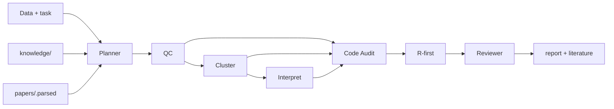

# Single-Cell RNA-seq Analysis Agent

LangGraph agent for single-cell bioinformatics: **tissue-aware QC, execution review, auditable scripts**. Focus: **scRNA-seq analysis** (~34 active skills). [`knowledge/`](README.md#knowledge-base) fused RAG + structured KB. Agents retrieve **parsed paper passages** (MinerU) and cite them in the report.

## Quick start

```bash
pip install -r requirements.txt && pip install -e ".[dev]"
# Optional high-quality PDF parser (papers RAG):
pip install -e ".[mineru]" && mineru-models-download -m pipeline
cp .env.example .env   # optional; OPENAI_API_KEY for LLM mode
python -m scagent init
python -m scagent run "Standard PBMC" --data tests/data/tiny_100cells.h5ad --tissue pbmc --dry-run
```

Real analysis: `pip install -r requirements-analysis.txt`, then `--execute`. Params in `config.yaml`.

## Architecture

**Planner → QC / Cluster / Interpret (strategy) → Code Audit → Reviewer → Writer**



| Layer | Role |
|-------|------|
| Planner | Batch/condition/replicates → DAG, skills, integration & DEG policy; injects paper hits |
| Specialists | Protocols only; each phase retrieves Methods/Results-weighted literature |
| Code Audit | Runs code (not strategy) |
| Writer | Report + **Literature-based best practices** section |
| Tool Router | Seurat/Harmony/Azimuth first; Scanpy fallback |

**Policies:** `n_replicates≥2` → mandatory pseudobulk + DESeq2/edgeR; UMAP mixing ≠ integration success; `--resume` via LangGraph + `.cache/snapshots/`.

## Data & batch

| Input | Notes |
|-------|-------|
| `.h5ad`, `.loom`, 10x/Cell Ranger, Seurat `.rds` | Multi-path → `obs['sample']`; large h5ad `backed='r'` |

Auto integration when ≥2 batches and sample ≠ condition 1:1: **Harmony** (default), **scVI** at ≥100k cells or ≥8 samples. `--integrator` overrides.

## CLI

| Flag / command | Description |
|----------------|-------------|
| `run "task" --data … --tissue …` | Main pipeline |
| `--dry-run` / `--execute` | Scripts only / Jupyter run |
| `--language r_first\|python\|r` | R-first / Scanpy / Rmd export only |
| `--interrupt` + `confirm mt\|resolution` | HITL checkpoints |
| `--condition-key` | Group pseudobulk DE |
| `--integrator`, `--ambient`, `--remove-doublets`, `--deg-engine`, `--qc-method` | See `run --help` |
| `ingest` / `retrieve` / `update-kb` / `add-doc` | Knowledge index |
| `parse-papers [--force] [--ingest]` | Parse PDFs → `.parsed/` section Markdown |
| `parse-papers --sanitize-only [--ingest]` | Clean control chars / HTML leftovers in existing `.parsed/` |
| `retrieve "…" --papers` | Paper-only search (Methods/Results boosted) |
| `view --serve`, `ask`, `snapshots`, `branch` | Viewer & forks |
| `--resume`, `--force-resume` | Checkpoint |

## Knowledge base

Index: `knowledge/.index/` (gitignore). Re-`ingest` after PDF/SOP changes or `update-kb`.

| Dir | Collection | Use |
|-----|------------|-----|
| `cell_ontology/` | `cell_ontology` | CL IDs |
| `marker_db/` | `marker_db` | Markers |
| `pathway/` | `pathway` | MSigDB / GO |
| `disease_signature/` | `disease_signature` | State signatures |
| `tissue_reference/` | `tissue_reference` | HCA tissues |
| `best_practices/` | `best_practices` | Step SOPs |
| `papers/`, `methods/`, `sops/` | same | Literature, method cards, lab SOPs |
| `upstream/` | `upstream` | sc-best-practices (`update-kb`, gitignore) |

`retrieve_fused` = BM25 + vectors + RRF; QC phase boosts QC SOPs. Structured lookup: `lookup_structured` / `lookup_knowledge`. Optional vectors: `pip install -e '.[rag]'`.

### Paper PDFs → RAG

1. Place PDFs in `knowledge/papers/` (curated notes as `*.md` optional).
2. Install parser: `pip install -e ".[mineru]"` then `mineru-models-download -m pipeline`  
   (CPU/Mac: keep `rag.papers.mineru.backend: pipeline` in `config.yaml`. Legacy: `pip install -e ".[magic-pdf]"`.)
3. Fallbacks: PyMuPDF → pdfplumber (core deps). Avoid `pypdf` for two-column papers.
4. Parse & index:

```bash
python -m scagent parse-papers --force --backend mineru --ingest
# After quality tweaks without re-OCR:
python -m scagent parse-papers --sanitize-only --ingest
```

Output: `knowledge/papers/.parsed/*.md` (+ `.meta.json`, gitignored). Text is sanitized (control chars, `<sub>`/`<sup>`, HTML entities, soft hyphens). Agent tool: `search_paper_knowledge`.

### Agents + literature

Planner / QC / Annotation / Interpretation call phase-aware `search_paper_knowledge` and inject passages into prompts. The written report includes **Literature-based best practices** with per-agent citations from `.parsed/` chunks.

## Tool Router

| Step | R | Python |
|------|---|--------|
| QC / cluster | Seurat | Scanpy |
| Batch | Harmony | scVI |
| Annotate | Azimuth | CellTypist + scANVI |

`SCAGENT_FORCE_PYTHON=1` forces Python.

## Skills layout

| Path | Role |
|------|------|
| `skills/*/SKILL.md` | Active **scRNA-seq** cookbooks (~34): QC → cluster → annotate → integrate → trajectory / CellChat / SCENIC |
| `skills/_archive/` | Spatial / ATAC / imaging / TCR / perturb / shell agents — **not loaded** |
| `knowledge/best_practices/` | Step decision SOPs (not the same as skills) |

`python -m scagent skills` lists active skills. Restore an archived pack by moving it back under `skills/<name>/`.

## Troubleshooting

| Issue | Fix |
|-------|-----|
| Report "not executed" | `--execute` + analysis requirements |
| Empty retrieve | `scagent ingest` |
| Empty / noisy papers | `parse-papers --force --backend mineru --ingest` or `--sanitize-only` |
| `mineru` / `torchvision` missing | `pip install -e ".[mineru]"` (pulls pipeline extras) |
| Resume version mismatch | `--force-resume` or new run |

```bash
pytest -q
```
