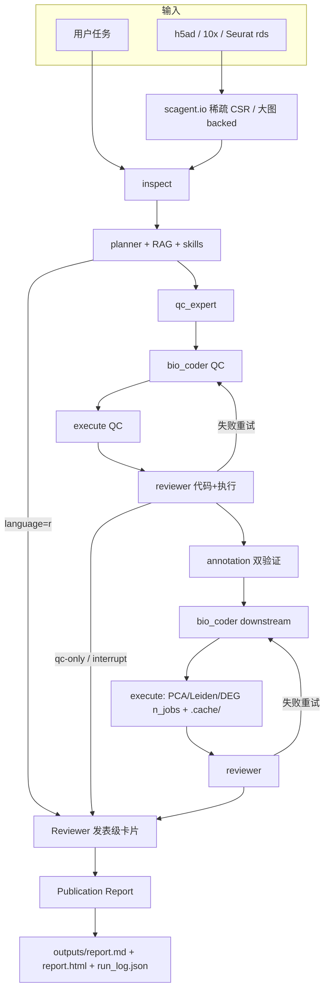

# Single-Cell RNA-seq Analysis Agent

LangGraph 单细胞生信智能体。相对 CellAgent / 泛用 SciAgent-Skills，这里强制 **组织感知 QC + 执行结果审查 + 可审计脚本**（不只是生成教程代码）。

现有 SciAgent-style skills **原样保留**。RAG 默认检索 `knowledge/papers`，并索引 `best_practices/reference/`（Heumos 2023 / sc-best-practices / 10x 步骤摘要）。

## Quick Start

```bash
pip install -r requirements.txt && pip install -e ".[dev]"
python -m scagent demo
python -m scagent run "demo QC + 注释" --data tests/data/tiny_100cells.h5ad --tissue pbmc --dry-run
```

或 4 行 Python：

```python
from scagent.demo import write_tiny_h5ad
from scagent.io import read_single_cell
adata = read_single_cell(write_tiny_h5ad())   # 100 cells, CSR sparse
print(adata)
```

Demo 是 100 细胞稀疏 `.h5ad`（`tests/data/tiny_100cells.h5ad`），供 CI 与本地试跑。真数据把路径换成你的 h5ad 即可。

## 工作流



工作流是 **Planner → Executor → Reviewer → Publication Report**。阶段 Reviewer 同时看 **代码** 和 **execution**（returncode、MAD 移除比例、h5ad、figures）；发表级 Reviewer 再汇总 QC / marker / DEG / 图 / 批次校正，给出 **PASS / FAIL / Missing** 与 **Overall score**。  
Annotation 产出可执行 CellTypist + ≥2 阳性 + ≥1 阴性 marker。  
Writer 只根据 `artifacts` 写报告，缺图写「未执行」。

## 安装

```bash
python -m venv .venv
source .venv/bin/activate
pip install -r requirements.txt
pip install -e ".[dev]"
# 真跑 Scanpy 分析再装分析栈（版本见 requirements-analysis.txt）：
pip install -r requirements-analysis.txt
# 或 Conda（分析栈走 conda-forge，agent 锁文件走 pip）：
# conda env create -f environment.yml && conda activate scagent && pip install -e ".[dev]"
cp .env.example .env   # 可选。无 OPENAI_API_KEY 时为确定性模板模式
```

容器（agent 运行时，不含完整 Scanpy/R）：

```bash
docker build -t scagent .
docker run --rm scagent
# Apptainer / Singularity
# apptainer build scagent.sif apptainer.def
# apptainer run scagent.sif skills
```

## 无 API Key 的确定性示例

```bash
python -m scagent ingest
python -m scagent run "对 PBMC 做标准分析并注释" --data /path/to/data.h5ad --tissue pbmc --dry-run
```

产物：

```
workspace/qc_preprocess.py
workspace/cluster_annotate.py
workspace/reproducible_script.py
workspace/run_manifest.json      # 种子、skill fingerprint、数据路径哈希前缀
outputs/report.md
outputs/report.html              # Markdown 转义 + 嵌入 figures
outputs/run_log.json             # 过滤统计、参数、skills、issue_records
outputs/memory.yaml              # 分析 provenance：步骤+参数，不是聊天；失败用 --from-checkpoint
```

未 `--execute` 时报告会写明图未生成。真跑：

```bash
python -m scagent run "..." --data data.h5ad --tissue pbmc --execute
```

## 配置与重现

路径、PCA 维数、HVG 数、Leiden resolution、LLM 重试/限速都在 `config.yaml`。**不要把 API key 写进 YAML**，只用环境变量 `OPENAI_API_KEY`（或 `model.api_key_env` 指定的名字）。

```yaml
params:
  n_pcs: 40
  n_neighbors: 15
  n_hvg: 2000
  leiden_resolution: null          # null = 扫描 leiden_resolutions
  leiden_resolutions: [0.2, 0.4, 0.6, 0.8, 1.0]
model:
  max_retries: 4
  retry_backoff_seconds: 1.0
  rate_limit_rpm: 60
logging:
  level: INFO
  file: outputs/scagent.log
performance:
  n_jobs: -1
  backed_threshold_cells: 250000
  cache: true   # 中间结果 .cache/
```

CLI `--resolution` 覆盖 `params.leiden_resolution`。日志走 `logging`（INFO/DEBUG/ERROR + 节点耗时），生成脚本里的 `SCAGENT_METRICS:` / `SCAGENT_WARN:` 仍是 stdout 协议，给 reviewer 解析。

## Notebook / 程序化 API

```python
from scagent.io import read_single_cell          # .h5ad / 10x / Seurat .rds
from scagent.preprocess import annotate_qc_genes, filter_dynamic, normalize_log1p, select_hvg
from scagent.analysis import pca, neighbors, leiden, umap
from scagent.plotting import qc_violin, qc_scatter
from scagent.config import analysis_params

adata = read_single_cell("data.h5ad")            # .rds 需要 R + zellkonverter，或 rpy2
# 超参来自 config.yaml，可函数参数覆盖
pca(adata)
```

Seurat `.rds` 走 `scagent/r/io.R`（zellkonverter）。Python 可执行路径仍是 AnnData；`--language r` 只规划、不生成半成品 Seurat。

## CLI

| 参数 | 作用 |
|------|------|
| `--dry-run` | 只写脚本 |
| `--execute` | 在 workspace 跑脚本 |
| `--qc-only` | 只做 QC 阶段 |
| `--annotate-only` | 跳过 QC，需已有 `adata_qc.h5ad` |
| `--interrupt` | QC 通过后暂停（人工看阈值），再用 `--annotate-only --yes` 继续 |
| `--resolution` | 固定 Leiden resolution |
| `--batch-key` | 批次列名 |
| `--markers` | 自定义 marker CSV/JSON |
| `--report-lang zh\|en\|both` | 报告语言 |
| `--language r` | 仅规划 + 警告，不生成 Seurat |
| `--thread-id` / `--resume` / `--from-checkpoint` | LangGraph SQLite checkpoint。崩溃后同一 thread 续跑，不重复已成功节点 |

```bash
python -m scagent retrieve "Harmony versus scVI"
python -m scagent retrieve "B cell MS4A1" --collections papers,markers
python -m scagent retrieve "pseudobulk FDR" --collections best_practices,papers
python -m scagent memory
python -m scagent skills
```

| `--integrator auto\|none\|harmony\|scvi\|cca` | 批次模块。`cca` 为 Scanorama（CCA/MNN 风格）；Seurat CCA 不自动生成 |
| `--impute none\|magic\|alra` | Dropout 插补，写入 `layers['imputed']`，不覆盖用于 DE 的 X |
| `--ambient auto\|none\|soupx\|decontx` | Ambient RNA。brain/tumor 的 `auto` 走 SoupX 风格校正，不只是警告 |
| `--remove-doublets` | Scrublet 写入 `predicted_doublet` 后过滤 |
| `--condition-key` | 组间比较列；触发 sample-level pseudobulk + FDR |
| `--qc-method mad\|percentile\|hybrid` | 动态阈值；`config.qc.hard` 为 null 时不套 mito%<5 |

把 PDF 放入 `knowledge/papers/` 后重新 `ingest`。步骤级最佳实践在 `best_practices/reference/`（QC、HVG、整合、注释、pseudobulk 等）。自定义 marker CSV 列：`cell_type,positive,negative,lineage`（`;` 分隔）。

## 设计选择

- **Skills**：不拆成 `skills/R` 与 `skills/python`。fingerprint 写入 `run_manifest.json`。
- **整合**：可选模块。单样本默认不做。`--integrator none` 可关。auto：小数据 Harmony，≥10 万细胞或 ≥8 样本 scVI；样本与条件 1:1 共线时跳过，避免把处理效应当批次抹掉。
- **HVG**：默认 `flavor=seurat_v3` 在 `layers['counts']` 上选，多样本按 batch 取并集（Heumos 2023）。无 counts 则回退 `seurat`。PCA `use_highly_variable=True`。探索性 Wilcoxon 强制 `use_raw`，不在 scale 后的 X 上做。
- **QC**：MAD / percentile / hybrid，组织 profile 可改 `nmads`。禁止默认 mito%<5。Scrublet 写入 `predicted_doublet`；脑/肿瘤默认 ambient 校正；细胞周期评分，`regress_cell_cycle: auto`。
- **注释**：按组织选择 CellTypist 模型（不用 Immune_All 套肝脏/心脏）。第二参考交叉验证 + marker 双验证。
- **DE**：探索性 Wilcoxon 仅用于 cluster marker；条件比较走 sample-level pseudobulk + FDR。
- **整合评估**：优先 scIB iLISI/kBET，否则 kNN-iLISI 与 PCA 批次 R²；不再只靠 cluster 主导批次比例。
- **插补**：MAGIC / ALRA 可选，不改 DE 用的 X。
- **RAG**：BM25 + 向量召回 + Rerank；中英同义扩展（批次效应校正 → Harmony）。文档按章节/段落切分。向量模型可选 `pip install -e '.[rag]'`（sentence-transformers），未安装时用稳定 hashing 向量。
- **Checkpoint**：`checkpoint.backend=sqlite` 持久化 AgentState（含 retry/execution）。`--thread-id` + `--resume` 从断点继续。
- **规划**：意图走 JSON schema（qc/clustering/deg/trajectory/annotation），步骤依赖在 `agents/dependencies.py`。
- **执行隔离**：LLM 脚本默认 seatbelt/bwrap + rlimit + 静态策略；密钥不传入子进程；超时杀进程组。`sandbox.network: auto` 时 QC 禁网、下游允许 CellTypist 下载。可选 `isolation: docker` + `SCAGENT_DOCKER_IMAGE`。`sandbox.enabled: false` 可关。
- **闭环**：执行失败把 stdout/stderr + metrics 回灌 bio_coder；Reviewer 产出结构化 `issue_records`；过过滤用 `qc.overfilter_warn_pct`。成功后的 h5ad 快照在 `.cache/steps/`。
- **鲁棒性**：LLM 指数退避重试、RPM 限速、token 用量写入日志；图节点用 `logging` 而不是 print。
- **性能**：CSR 稀疏；`n_obs ≥ backed_threshold_cells` 时 h5ad `backed='r'`；Scanpy `n_jobs` + joblib 并行 marker/DEG。
- **缓存**：耗时步骤写入 `.cache/`（QC h5ad、聚类、LLM JSON），中断后可续跑。

## 常见失败

| 现象 | 处理 |
|------|------|
| 报告写「未执行」 | 加 `--execute`，并 `pip install -r requirements-analysis.txt` |
| 缺少 violin/scatter | 不要删 LOCKED QC 块 |
| `harmonypy` / CellTypist 警告 | 安装 analysis extra；脚本会降级并写 `SCAGENT_WARN` |
| `--language r` 退出码 2 | 预期：未实现可执行 Seurat |
| 执行失败仍进注释 | 不应发生；QC returncode≠0 会重试或停在发表级 Reviewer 后写报告 |

## 测试

```bash
pytest -q
```

有 scanpy/anndata 时会跑小型合成 h5ad 的 QC 执行测试。Push/PR 走 GitHub Actions（pytest + flake8 + black）。

Skills 参考：[SciAgent-Skills single-cell](https://github.com/jaechang-hits/SciAgent-Skills/tree/main/skills/genomics-bioinformatics/single-cell)
