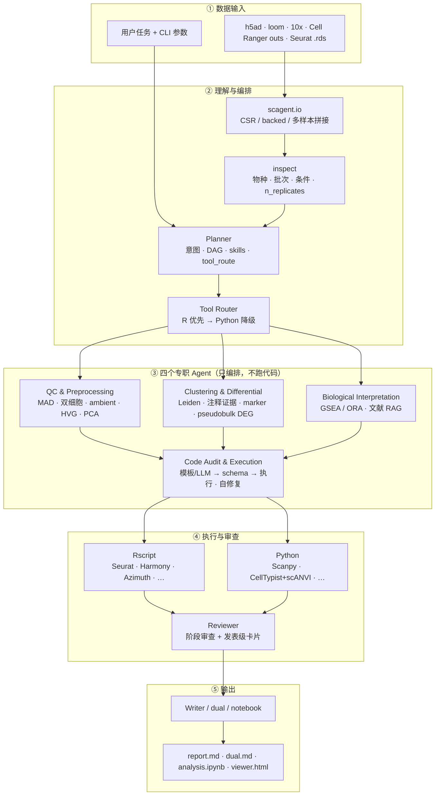
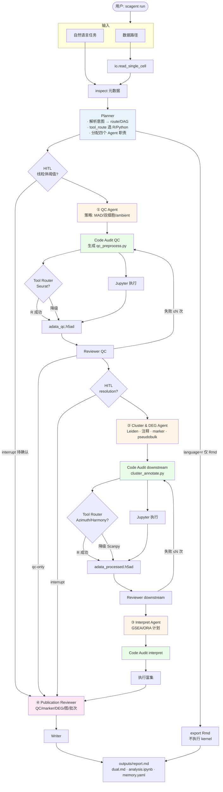

# Single-Cell RNA-seq Analysis Agent

> **Languages:** 中文（本文） | [English](README.en.md)

LangGraph 单细胞生信智能体。相对 CellAgent / 泛用 SciAgent-Skills，这里强制 **组织感知 QC + 执行结果审查 + 可审计脚本**（不只是生成教程代码）。

现有 SciAgent-style skills **原样保留**。RAG 默认检索 `knowledge/papers`，并索引 `best_practices/`（`reference/` 步骤摘要 + `update-kb` 拉取的 sc-best-practices）以及 `knowledge/sops/`（实验室 SOP）。

## Quick Start

```bash
pip install -r requirements.txt && pip install -e ".[dev]"
python -m scagent init
python -m scagent demo
python -m scagent run "demo QC + 注释" --data tests/data/tiny_100cells.h5ad --tissue pbmc --dry-run
```

新用户可用 `scagent init` 交互填写数据路径、组织类型、分析任务和内存/CPU/超时；会写出 `outputs/init.yaml` 与可选的 `config.local.yaml`（不覆盖 `config.yaml`，也不写 API key），并打印等价的 `scagent run …` 命令。`--yes` 用默认值；`--run` 写完立刻开跑。

或 4 行 Python：

```python
from scagent.demo import write_tiny_h5ad
from scagent.io import read_single_cell
adata = read_single_cell(write_tiny_h5ad())   # 100 cells, CSR sparse
print(adata)
```

Demo 是 100 细胞稀疏 `.h5ad`（`tests/data/tiny_100cells.h5ad`），供 CI 与本地试跑。真数据把路径换成你的 h5ad 即可。

## 工作流

### 系统架构总览

下图从**分层**视角展示 scAgent 各模块如何协作：数据进入后先 inspect 与 Planner 编排；四个专职 Agent 只产出**分析策略与协议**（不写可执行代码）；Code Audit 统一生成脚本并按 **Tool Router（R 优先）** 执行；Reviewer 把关后 Writer 汇总报告。



| 层级 | 模块 | 作用 |
|------|------|------|
| 数据输入 | `scagent.io` | 统一读入多格式，大图 backed、多样本 `obs['sample']` |
| 理解与编排 | inspect + Planner | 检测批次/条件/重复数，生成 DAG、skills、整合与 DEG 策略 |
| Tool Router | `scagent/tool_router` | SciAgent 默认：**R 生态优先**，缺包则 Scanpy 降级 |
| 专职 Agent | QC / Cluster / Interpret | 输出协议与参数，**不直接执行**分析 |
| 执行 | Code Audit | 生成 `workspace/*.py`，Jupyter 或 Rscript 跑通并写 metrics |
| 审查 | Reviewer | 代码 AST/DAG + 执行结果 + 发表级 checklist |
| 输出 | Writer | 只读 `artifacts`，缺图写「未执行」 |

---

### 端到端流程（含 HITL 与重试）



**图例**：蓝色 = 编排；橙色 = 领域专家 Agent；绿色 = 代码生成与执行；粉色 = 发表级审查。

工作流本质是 **Planner（只编排）→ 四个专职 Agent 出策略 → Code Audit 统一落地 → Publication Report**。

| Agent | 职责 | 典型产出 |
|-------|------|----------|
| QC & Preprocessing | 数据校验、MAD/双细胞/ambient、HVG、PCA | `qc_strategy`、LOCKED QC 块 |
| Clustering & Differential | Leiden、CellTypist+scANVI/Azimuth、marker 双验证、pseudobulk DEG | `annotation_plan`、`cluster_annotate.py` |
| Biological Interpretation | 通路富集（GSEA/GSVA/ORA）+ 本地 RAG | `interpretation_plan` |
| Code Audit & Execution | 策略→可执行代码、schema/DAG 拦截、Rscript/Jupyter、失败自修复 | `workspace/*.py`、`run_manifest.json` |

阶段 Reviewer 同时审查 **代码** 与 **execution**（metrics、`SCAGENT_WARN`）；发表级 Reviewer 汇总 QC / marker / DEG / 图 / 批次校正。Writer **只**根据 `artifacts` 写报告，未 `--execute` 时标明「未执行」。

**Checkpoint**：LangGraph SQLite 保存 AgentState；h5ad 快照在 `.cache/snapshots/`，可用 `--resume` 续跑。

## 安装

```bash
python -m venv .venv
source .venv/bin/activate
pip install -r requirements.txt
pip install -e ".[dev]"
# 真跑 Scanpy 分析再装分析栈（版本见 requirements-analysis.txt）：
pip install -r requirements-analysis.txt
# 或 Conda（分析栈走 conda-forge，agent 锁文件走 pip）：
# conda env create -f environment.yml && conda activate scagent && pip install -e ".[dev]"
cp .env.example .env   # 可选。无 OPENAI_API_KEY 时为确定性模板模式
```

容器（agent 运行时，不含完整 Scanpy/R）：

```bash
docker build -t scagent .
docker run --rm scagent
# Apptainer / Singularity
# apptainer build scagent.sif apptainer.def
# apptainer run scagent.sif skills
```

## 无 API Key 的确定性示例

```bash
python -m scagent ingest
python -m scagent update-kb
python -m scagent add-doc ./lab_sop.md
python -m scagent run "对 PBMC 做标准分析并注释" --data /path/to/data.h5ad --tissue pbmc --dry-run
```

产物：

```
workspace/qc_preprocess.py
workspace/cluster_annotate.py
workspace/reproducible_script.py
workspace/run_manifest.json      # scAgent 版本、种子、skill fingerprint、环境 hash、step I/O provenance
outputs/report.md
outputs/report.html              # Markdown 转义 + 嵌入 figures
outputs/run_log.json             # 过滤统计、参数、skills、issue_records
outputs/memory.yaml              # 分析 provenance：步骤+参数，不是聊天；失败用 --from-checkpoint
outputs/dual.md                  # 每阶段 [结论] + [代码]；文末含发表级图表清单
outputs/analysis.ipynb           # 结论 cell + Scanpy 代码 cell；Jupyter 后台执行（R 为 analysis.Rmd / Seurat）
outputs/viewer.html              # Plotly 交互 UMAP：框选/套索细胞后提问；侧栏发表级主图链接
```

未 `--execute` 时报告会写明图未生成。真跑：

```bash
python -m scagent run "..." --data data.h5ad --tissue pbmc --execute
```

## 配置与重现

路径、PCA 维数、HVG 数、Leiden resolution、LLM 重试/限速都在 `config.yaml`。**不要把 API key 写进 YAML**，只用环境变量 `OPENAI_API_KEY`（或 `model.api_key_env` 指定的名字）。

```yaml
params:
  n_pcs: 40
  n_neighbors: 15
  n_hvg: 2000
  leiden_resolution: null          # null = 扫描 leiden_resolutions
  leiden_resolutions: [0.2, 0.4, 0.6, 0.8, 1.0]
model:
  max_retries: 4
  retry_backoff_seconds: 1.0
  rate_limit_rpm: 60
logging:
  level: INFO
  file: outputs/scagent.log
performance:
  n_jobs: -1
  backed_threshold_cells: 250000
  cache: true   # 中间结果 .cache/
  dask:
    enabled: false              # 实验性 Dask/out-of-core（≥ threshold_cells 时 backed + scagent_dask）
    threshold_cells: 500000
  gpu:
    enabled: false              # CUDA 可用时 scVI GPU；rapids=true 需 rapids-singlecell
    scvi: true
    rapids: false
```

CLI `--resolution` 覆盖 `params.leiden_resolution`。`run_manifest.json` 强制记录：`environment.hash`（pip freeze / conda export / package_versions）、`seed_propagation`（HVG/Leiden/UMAP 等统一种子）、`step_provenance`（各步 AnnData shape 与 obs/var 列）。日志走 `logging`（INFO/DEBUG/ERROR + 节点耗时），生成脚本里的 `SCAGENT_METRICS:` / `SCAGENT_WARN:` 仍是 stdout 协议，给 reviewer 解析。

## Notebook / 程序化 API

```python
from scagent.io import read_single_cell          # .h5ad / .loom / 10x mtx / Cell Ranger outs / Seurat .rds
from scagent.preprocess import annotate_qc_genes, filter_dynamic, normalize_log1p, select_hvg
from scagent.analysis import pca, neighbors, leiden, umap
from scagent.plotting import qc_violin, qc_scatter
from scagent.config import analysis_params

adata = read_single_cell("data.h5ad")            # .loom 需 loompy；.rds 需要 R + zellkonverter，或 rpy2
# 多样本：逗号分隔或指向含多个 Cell Ranger 样本的父目录，拼接后 obs['sample'] 标记来源
# adata = read_single_cell("s1/outs,s2/outs")
# 超参来自 config.yaml，可函数参数覆盖
pca(adata)
```

Seurat `.rds` 走 `scagent/r/io.R`（zellkonverter）。Python 可执行路径仍是 AnnData。`--language r` 写出双重格式 `analysis.Rmd`（Seurat 可运行块）；scAgent 不执行 R kernel。

## 数据输入

`--data` / `read_single_cell` 支持：

| 格式 | 示例 | 说明 |
|------|------|------|
| AnnData | `data.h5ad` | 默认；大图自动 `backed='r'` |
| Loom | `data.loom` | 需 `pip install loompy`（`.[loom]`） |
| 10x mtx | `filtered_feature_bc_matrix/` | `matrix.mtx.gz` + barcodes + features |
| Cell Ranger `outs/` | `sample/outs` 或 `sample/` | 自动下钻 `outs/filtered_feature_bc_matrix`（或同名 `.h5`） |
| Seurat | `obj.rds` / `.h5seurat` | 转 AnnData（R + zellkonverter 或 rpy2） |
| 多样本 | `s1.h5ad,s2.h5ad` 或样本父目录 | 拼接后 `obs['sample']` 为文件夹名；barcode 加样本前缀 |

```bash
python -m scagent run "多样本整合+注释" --data sample1/outs,sample2/outs --tissue pbmc --dry-run
python -m scagent run "..." --data /proj/cellranger_runs/ --tissue pbmc   # 父目录下多个样本
```

CSV 仍不支持。Loom 未装 loompy 时会明确报错，不会假装读入。

## 批次校正自动决策

inspect 阶段会：

1. 扫描 obs 中的 `sample` / `batch` / `donor` / `orig.ident` / `library_id` / `sample_id`（可用 `--batch-key` 指定）。
2. 把逗号分隔路径或 Cell Ranger 多样本父目录视为多个样本，写入 `obs['sample']`。
3. 若 ≥2 个批次且样本与条件不是 1:1 共线 → `need_batch_correction=True`，Planner **自动触发校正**（不必手写 `--integrator`）。

| 条件 | auto 选择 |
|------|-----------|
| 单样本、无批次列 | 不做整合 |
| 样本与条件 1:1 共线 | 跳过（避免 overcorrection，Luecken 2022） |
| n_cells ≥ 10 万或 n_samples ≥ 8 | scVI |
| 其余多样本 | Harmony |

`--integrator harmony|scvi|cca|scanorama|bbknn` 可覆盖。BBKNN 改邻居图、不产出校正后 PCA，缺包时脚本回退 Harmony。Publication Report 会写：**检测到的批次列与样本数、选用方法及理由、校正前后 PCA/UMAP 批次着色、iLISI / kBET / PCA-R²**。UMAP 混匀不是整合成功的证据。

## CLI

> 完整英文参数说明见 [README.en.md § CLI reference](README.en.md#cli-reference)。运行 `python -m scagent --help` 或 `python -m scagent run --help` 亦可查看英文 `--help`。

| 参数 | 作用 |
|------|------|
| `scagent init` | 交互式配置向导：数据路径、组织、任务、资源限制；`--yes` 用默认值 |
| `--dry-run` | 只写脚本 |
| `--execute` | 在 workspace 用 Jupyter 跑脚本（无 OS jail） |
| `--language r` | 双重格式 Seurat Rmd；scAgent 不执行 R kernel |
| `--qc-only` | 只做 QC 阶段 |
| `--annotate-only` | 跳过 QC，需已有 `adata_qc.h5ad` |
| `--interrupt` | 在线粒体阈值与 Leiden resolution 两处暂停；看 `outputs/decisions/*.html` 再 `scagent confirm` |
| `--resolution` | 固定 Leiden resolution（跳过 resolution 确认） |
| `scagent update-kb` | 拉取最新 sc-best-practices 到 `best_practices/upstream/` 并重建索引 |
| `scagent add-doc <path>` | 把实验室 SOP（md/txt/pdf/ipynb）复制到 `knowledge/sops/` 并纳入 RAG |
| `scagent confirm mt\|resolution <选项>` | 湿实验选定预设档后继续下阶段 |
| `--batch-key` | 批次列名 |
| `--markers` | 自定义 marker CSV/JSON |
| `--report-lang zh\|en\|both` | 报告语言 |
| `--thread-id` / `--resume` / `--from-checkpoint` | LangGraph SQLite checkpoint。崩溃后同一 thread 续跑，不重复已成功节点。`--resume` 会核对 `run_manifest.json` 的 `scagent_version`：主版本不同则拒绝（`--force-resume` 可覆盖），次版本不同则警告 |
| `--force-resume` | 主版本不兼容时仍强制续跑 |

```bash
python -m scagent update-kb
python -m scagent add-doc ./lab_qc_sop.md
python -m scagent retrieve "Harmony versus scVI"
python -m scagent retrieve "B cell MS4A1" --collections papers,markers
python -m scagent retrieve "pseudobulk FDR" --collections best_practices,papers
python -m scagent memory
python -m scagent view --serve
python -m scagent ask "分析我框选的这组细胞" --selection outputs/selection.json
python -m scagent confirm mt recommended
python -m scagent confirm resolution 0.4
python -m scagent snapshots --thread-id THREAD
python -m scagent branch --from-thread THREAD --as exp-res04 --step qc --checkout
python -m scagent skills
```

| `--integrator auto\|none\|harmony\|scvi\|cca\|scanorama\|bbknn` | 批次模块。inspect 检测到批次后 auto 触发。`cca`/`scanorama` 为 Scanorama；`bbknn` 改邻居图（缺包回退 Harmony） |
| `--impute none\|magic\|alra` | Dropout 插补，写入 `layers['imputed']`，不覆盖用于 DE 的 X |
| `--ambient auto\|none\|soupx\|decontx` | Ambient RNA。brain/tumor 的 `auto` 走 SoupX 风格校正，不只是警告 |
| `--remove-doublets` | 按 `doublet_filter` 过滤双细胞（默认仅高置信） |
| `--doublet-filter high_conf\|all` | `high_conf`=保守（仅移除高置信）；`all`=严格（高+低均移除） |
| `--doublet-methods auto\|scrublet\|both` | `auto`：多样本/复杂组织 Scrublet+scDblFinder（无 R 则表达模拟） |
| `--condition-key` | 组间比较列；触发 sample-level pseudobulk DE |
| `--deg-engine auto\|edger\|deseq2\|ttest` | 组间 DEG 后端。`auto`：rpy2 edgeR → DESeq2 → Rscript → t-test+BH。任务描述里写 DESeq2 等也会被识别 |
| `--marker-method auto\|wilcoxon\|t-test\|mast` | 探索性 cluster marker |
| `--deg-cross-validate auto\|on\|off` | 第二检验交叉验证基因列表 |
| `--qc-method mad\|percentile\|hybrid` | 动态阈值；`config.qc.hard` 为 null 时不套 mito%<5 |
| `--dask` | 实验性 Dask/out-of-core 大图路径 |
| `--gpu` | CUDA 可用时为 scVI 启用 GPU |
| `--rapids` | RAPIDS neighbors/UMAP（需 rapids-singlecell） |

把 PDF 放入 `knowledge/papers/` 后重新 `ingest`。`scagent update-kb` 从 [theislab/single-cell-best-practices](https://github.com/theislab/single-cell-best-practices) 拉取最新章节到 `best_practices/upstream/` 并重建索引。实验室 SOP：`scagent add-doc <path>`，写入 `knowledge/sops/`。步骤级摘要仍在 `best_practices/reference/`。自定义 marker CSV 列：`cell_type,positive,negative,lineage`（`;` 分隔）。

## Tool Router（R 优先）

与 SciAgent 原生路由一致：**Always use R ecosystem first. Only invoke Python when R lacks the required functionality.**

| 功能 | R 默认 | Python 备用 |
|------|--------|-------------|
| QC / Normalize | Seurat | Scanpy |
| Integration | Harmony (R) | harmonypy / scVI / Scanorama |
| Annotation | Azimuth | CellTypist + scANVI → `scagent_annotation` |
| Trajectory | Monocle3 | DPT / PAGA / Palantir / scVelo |
| CellChat | CellChat (R) | — |
| Spatial | Giotto | Squidpy |

配置见 `config.yaml` → `tool_router` + `analysis.language`：

- **`r_first`**（默认）：模板开头尝试 `Rscript scagent/r/pipeline_*.R`；失败则 `SCAGENT_WARN` 并走 Scanpy
- **`python`**：始终 Scanpy
- **`r`**：legacy，仅写 `analysis.Rmd`，不在 scAgent 内执行

强制 Python 降级：`SCAGENT_FORCE_PYTHON=1 python -m scagent run …`

## 设计选择

- **Skills**：不拆成 `skills/R` 与 `skills/python`。fingerprint 写入 `run_manifest.json`。内置 **142** 个单细胞 skill：保留原有 10 个 SciAgent core，并从 [awesome-bio-agent-skills](https://github.com/BioTender-max/awesome-bio-agent-skills) 同步 **144** 条 `bioskill_index_v3.csv` 单细胞索引（去重后 132 新增；清单见 `skills/awesome_single_cell_manifest.json`）。Planner 按任务关键词推荐子集；`python -m scagent skills` 列出全部。
- **版本兼容**：`run_manifest.json` 写入 `scagent_version`。`--resume` 时对照当前包版本：主版本变更拒绝续跑（分析脚本/schema 可能不兼容），次版本警告，`--force-resume` 可覆盖。无版本字段的旧 manifest 警告后继续。
- **整合**：可选模块。inspect 扫描 `sample`/`batch`/`donor`/`orig.ident`/`library_id` 等列，或把 `--data` 的多个路径当作多样本。检测到 ≥2 批次且与条件非 1:1 共线时，**auto 自动校正**。默认 Harmony；≥10 万细胞或 ≥8 样本改 scVI。`--integrator none` 可关；`cca`/`scanorama`=Scanorama，`bbknn` 改邻居图。样本与条件 1:1 共线时跳过，避免把处理效应当批次抹掉。报告写决策理由、校正前后 PCA/UMAP 批次着色，以及 iLISI/kBET/PCA-R²；**禁止把 UMAP 混匀当整合成功**。
- **HVG**：默认 `flavor=seurat_v3` 在 `layers['counts']` 上选，多样本按 batch 取并集（Heumos 2023）。无 counts 则回退 `seurat`。PCA `use_highly_variable=True`。探索性 Wilcoxon 强制 `use_raw`，不在 scale 后的 X 上做。
- **QC**：MAD / percentile / hybrid，组织 profile 可改 `nmads`。禁止默认 mito%<5。双细胞：Scrublet；多样本/复杂组织再交叉验证 scDblFinder（无 R 则表达模拟），写入三级 `doublet_call`（`doublet_high_conf` / `doublet_low_conf` / `singlet`）。`--remove-doublets` + `doublet_filter` 可选保守（仅高置信）或严格（高+低）过滤。脑/肿瘤默认 ambient 校正；细胞周期评分，`regress_cell_cycle: auto`。
- **注释**：CellTypist + scANVI 集成（`max_prob < 0.8` 自动 scANVI 后备 → `obs['scagent_annotation']`）+ marker 双验证 + `fuse_annotation` 多数表决。
- **组间 DEG**：`--condition-key` 且每条件 ≥2 个生物学重复时，**强制** sample-level pseudobulk + DESeq2/edgeR；禁止 cell-level Wilcoxon 作组间结论（cluster marker 探索性 Wilcoxon 仍可用）。
- **轨迹 / 命运**：聚类后评估 PAGA 是否像连续分化。支持则拟合 **DPT+PAGA** 分化轴与基因趋势图；已装 **Palantir** 则一并跑；**scVelo** 仅在 `spliced`/`unspliced` 层存在时运行；**Monocle3** 走可选 Rscript。离散 PBMC 不强行画命运轴。`modules.trajectory`: auto | force | off。
- **DE**：探索性 cluster marker 默认 Wilcoxon，可在任务中指定 **t-test / MAST / DESeq2 / edgeR**。组间比较按 sample × cell type 加和 raw counts（edgeR QL / DESeq2 / t-test+BH），**不用**细胞水平 Wilcoxon/MAST 当结论。默认跑第二检验做基因列表交叉验证（overlap/Jaccard 写入 metrics，Reviewer 会读）。`--deg-engine` / `--marker-method` / `--deg-cross-validate` 或 `config.deg.*` 可固定。MAST 需 R 包，缺则跳过。
- **整合评估**：优先 scIB iLISI/kBET，否则 kNN-iLISI 与 PCA 批次 R²；不再只靠 cluster 主导批次比例。Reviewer 还会生成校正前后 PCA/UMAP 批次着色诊断图，并嵌入 Publication Report；UMAP 混匀不是整合成功的证据。
- **插补**：MAGIC / ALRA 可选，不改 DE 用的 X。
- **RAG**：BM25 + 向量召回 + Rerank；中英同义扩展（批次效应校正 → Harmony）。文档按章节/段落切分。`update-kb` / `add-doc` 后自动 `ingest`。向量模型可选 `pip install -e '.[rag]'`（sentence-transformers），未安装时用稳定 hashing 向量。
- **Checkpoint**：LangGraph SQLite 只存 AgentState（路径与参数），**从不把 AnnData 放进 state**。h5ad 快照在 `.cache/snapshots/<thread>/`：能硬链接就不拷贝 X；X 未变时只存 obs 增量。`scagent snapshots` / `scagent branch --from-thread … --as …` 分叉参数实验。
- **可复现导出**：每阶段同步写出 **[结论] + [代码]**（`outputs/dual.md`）。Python 路径为 `outputs/analysis.ipynb`（markdown 结论 cell + 无污染 Scanpy 代码 cell；空间任务才写 Squidpy）。`--execute` 默认用 **Jupyter**（nbclient/ipykernel）在 `workspace/` 后台执行，**不走 seatbelt/bwrap**，避免挡住写图；静态 policy + DAG schema 仍拦截危险调用。`--language r` 写双重格式 `analysis.Rmd`（Seurat 可运行块），scAgent 不执行 R kernel。
- **交互查看**：`outputs/viewer.html` 用 Plotly.js（CDN）画 UMAP/violin，支持 Box/Lasso 框选。`scagent view --serve` 可当场提问；或下载 `selection.json` 再 `scagent ask --selection …`。静态 PNG 仍保留给论文。
- **HITL**：`--interrupt` 时，线粒体过滤与 Leiden resolution 会先给出直方图和 2–3 个预设档（含理由），`scagent confirm` 后才进入下一阶段。默认（无 `--interrupt`）仍自动走推荐档，但同样写出 `outputs/decisions/*.html`。
- **规划**：Plan-and-Solve。意图走 JSON schema（qc/clustering/deg/trajectory/annotation），步骤 DAG 在 `agents/dependencies.py`：PCA → neighbors → UMAP/Leiden，之后才能 DE 或 DPT/PAGA/Palantir/scVelo/Monocle3。
- **执行隔离**：`analysis.executor: jupyter`（默认）= Notebook 内核、无 OS jail。`executor: subprocess` 才启用 seatbelt/bwrap + rlimit。两种路径都做静态策略与 schema；密钥不传入子进程。`sandbox.network: auto` 时 QC 禁网、下游允许 CellTypist 下载（subprocess 路径）。`sandbox.enabled: false` 仅影响 subprocess。
- **闭环**：Code Audit Agent 生成代码先做 AST/DAG schema 校验，再进 Jupyter 执行；执行失败把 stdout/stderr + metrics 回灌自动修语法/参数。Reviewer 产出结构化 `issue_records`；过过滤用 `qc.overfilter_warn_pct`。
- **鲁棒性**：LLM 指数退避重试、RPM 限速、token 用量写入日志；图节点用 `logging` 而不是 print。
- **性能**：CSR 稀疏；`n_obs ≥ backed_threshold_cells` 时 h5ad `backed='r'`；Scanpy `n_jobs` + joblib 并行 marker/DEG。
- **缓存**：耗时步骤写入 `.cache/`（QC h5ad、聚类、LLM JSON），中断后可续跑。

## 常见失败

| 现象 | 处理 |
|------|------|
| 报告写「未执行」 | 加 `--execute`，并 `pip install -r requirements-analysis.txt` |
| 缺少 violin/scatter | 不要删 LOCKED QC 块 |
| `harmonypy` / CellTypist 警告 | 安装 analysis extra；脚本会降级并写 `SCAGENT_WARN` |
| `--language r` 退出码 2 | 预期：写出 Seurat Rmd，但不在 scAgent 内执行 |
| `--resume` 退出码 2（主版本不同） | 分析脚本与当前 scAgent 不兼容。确认后 `--force-resume`，或新开一次 run |
| 执行失败仍进注释 | 不应发生；QC returncode≠0 会重试或停在发表级 Reviewer 后写报告 |

## 测试

```bash
pytest -q
```

有 scanpy/anndata 时会跑小型合成 h5ad 的 QC 执行测试。Push/PR 走 GitHub Actions（pytest + flake8 + black）。

Skills 参考：原有 [SciAgent-Skills single-cell](https://github.com/jaechang-hits/SciAgent-Skills/tree/main/skills/genomics-bioinformatics/single-cell)（10 个 core skill 原样保留）；并 vendor [awesome-bio-agent-skills](https://github.com/BioTender-max/awesome-bio-agent-skills) 的 **Single-Cell Analysis** 全部分类（144 索引 → 142 目录，`scripts/sync_awesome_single_cell_skills.py` 可重同步）。legacy [`single-cell-annotation`](https://github.com/jaechang-hits/SciAgent-Skills/blob/main/legacy/single-cell-annotation/SKILL.md) 与 [`cellchat-cell-communication`](https://github.com/jaechang-hits/SciAgent-Skills/tree/main/skills/systems-biology-multiomics/cellchat-cell-communication) 仍在 `skills/` 下。
