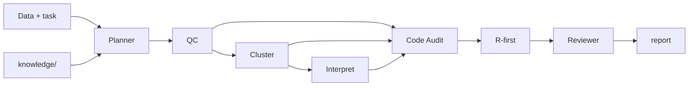

# Single-Cell RNA-seq Analysis Agent

LangGraph agent for single-cell bioinformatics: **tissue-aware QC, execution review, auditable scripts**. **99** bundled skills; [`knowledge/`](README.md#knowledge-base) fused RAG + structured KB (CL, markers, pathways, disease signatures, tissue maps).

## Quick start

```bash
pip install -r requirements.txt && pip install -e ".[dev]"
cp .env.example .env   # optional; OPENAI_API_KEY for LLM mode
python -m scagent init
python -m scagent run "Standard PBMC" --data tests/data/tiny_100cells.h5ad --tissue pbmc --dry-run
```

Real analysis: `pip install -r requirements-analysis.txt`, then `--execute`. Params in `config.yaml`.

## Architecture

**Planner → QC / Cluster / Interpret (strategy) → Code Audit → Reviewer → Writer**



| Layer | Role |
|-------|------|
| Planner | Batch/condition/replicates → DAG, skills, integration & DEG policy |
| Specialists | Protocols only; Code Audit runs code |
| Tool Router | Seurat/Harmony/Azimuth first; Scanpy fallback |

**Policies:** `n_replicates≥2` → mandatory pseudobulk + DESeq2/edgeR; UMAP mixing ≠ integration success; `--resume` via LangGraph + `.cache/snapshots/`.

## Data & batch

| Input | Notes |
|-------|-------|
| `.h5ad`, `.loom`, 10x/Cell Ranger, Seurat `.rds` | Multi-path → `obs['sample']`; large h5ad `backed='r'` |

Auto integration when ≥2 batches and sample ≠ condition 1:1: **Harmony** (default), **scVI** at ≥100k cells or ≥8 samples. `--integrator` overrides.

## CLI

| Flag / command | Description |
|----------------|-------------|
| `run "task" --data … --tissue …` | Main pipeline |
| `--dry-run` / `--execute` | Scripts only / Jupyter run |
| `--language r_first\|python\|r` | R-first / Scanpy / Rmd export only |
| `--interrupt` + `confirm mt\|resolution` | HITL checkpoints |
| `--condition-key` | Group pseudobulk DE |
| `--integrator`, `--ambient`, `--remove-doublets`, `--deg-engine`, `--qc-method` | See `run --help` |
| `ingest` / `retrieve` / `update-kb` / `add-doc` | Knowledge index |
| `view --serve`, `ask`, `snapshots`, `branch` | Viewer & forks |
| `--resume`, `--force-resume` | Checkpoint |

## Knowledge base

Index: `knowledge/.index/` (gitignore). Re-`ingest` after PDF/SOP changes or `update-kb`.

| Dir | Collection | Use |
|-----|------------|-----|
| `cell_ontology/` | `cell_ontology` | CL IDs |
| `marker_db/` | `marker_db` | Markers |
| `pathway/` | `pathway` | MSigDB / GO |
| `disease_signature/` | `disease_signature` | State signatures |
| `tissue_reference/` | `tissue_reference` | HCA tissues |
| `best_practices/` | `best_practices` | Step SOPs |
| `papers/`, `methods/`, `sops/` | same | Literature, method cards, lab SOPs |
| `upstream/` | `upstream` | sc-best-practices (`update-kb`, gitignore) |

`retrieve_fused` = BM25 + vectors + RRF; QC phase boosts QC SOPs. Structured lookup: `lookup_structured` / `lookup_knowledge`. Optional vectors: `pip install -e '.[rag]'`.

## Tool Router

| Step | R | Python |
|------|---|--------|
| QC / cluster | Seurat | Scanpy |
| Batch | Harmony | scVI |
| Annotate | Azimuth | CellTypist + scANVI |

`SCAGENT_FORCE_PYTHON=1` forces Python.

## Troubleshooting

| Issue | Fix |
|-------|-----|
| Report "not executed" | `--execute` + analysis requirements |
| Empty retrieve | `scagent ingest` |
| Resume version mismatch | `--force-resume` or new run |

```bash
pytest -q
```
